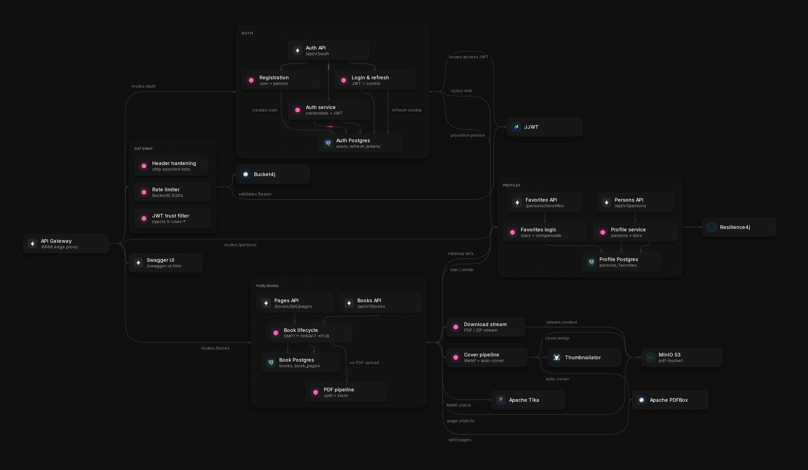

# BookHub

A microservices platform for publishing and reading books.
Authors upload PDFs; the system splits them into pages, stores media in object storage, and streams content to readers.
Written in Java and Spring Boot, built with Gradle, and containerized with Docker Compose.

---

## Architecture



---

## Tech Stack

- **Language:** Java 21
- **Build Tool:** Gradle
- **Frameworks:** Spring Boot 4.0.6, Spring Cloud Gateway, Spring Security, Spring Data JPA, Spring RestClient
- **Databases:** PostgreSQL 18 (one per service)
- **Object Storage:** MinIO (S3-compatible API)
- **Others:**
  - Flyway
  - MapStruct
  - JWT (Access + Refresh Token)
  - Resilience4j (Circuit Breaker + Retry)
  - Apache PDFBox, Apache Tika, Thumbnailator
  - Bucket4j rate limiting
  - springdoc OpenAPI
  - Testcontainers, WireMock, JUnit 5
  - Lombok
  - Docker / Docker Compose

---

## Description

BookHub is a multi-service backend with a single API Gateway entry point:

- **api-gateway** — routing, JWT validation, rate limiting, aggregated Swagger UI
- **auth-service** — registration, login, access JWT and refresh cookies
- **profile-service** — persons, biographies, favorite authors and books
- **book-service** — book catalog, page lifecycle, PDF/cover processing, downloads

Each business service owns its own PostgreSQL database (database-per-service).
Book PDFs and covers are stored in MinIO.

Services communicate synchronously over HTTP via `RestClient` and hexagonal ports/adapters.
Cross-service calls use an internal secret (`ROLE_INTERNAL`).
Critical paths between profile and book are protected with Resilience4j Circuit Breaker and Retry.
Distributed workflows (registration, favorites ↔ book stars, role sync) use compensating transactions instead of 2PC.

---

## Features

- ✅ **API Gateway** with JWT trust boundary and spoofed-header protection
- ✅ **JWT Auth** (Access token + HttpOnly Refresh cookie)
- ✅ **User registration** with profile provisioning and rollback on failure
- ✅ **Database-per-service** layout (auth / profile / book)
- ✅ **Inter-service REST** via RestClient + ports & adapters
- ✅ **Resilience4j** Circuit Breaker and Retry on profile ↔ book calls
- ✅ **Compensating transactions** for cross-service consistency
- ✅ **PDF upload pipeline** — MIME validation (Tika), split into pages (PDFBox), store in MinIO
- ✅ **Lazy full-book assembly** — merge pages on download, cache `content.pdf` in S3
- ✅ **Cover images** — WebP conversion, A4 aspect-ratio check, auto-cover from first PDF page
- ✅ **Streaming downloads** — `StreamingResponseBody` / `InputStreamResource` from MinIO
- ✅ **Page-level editing** — each page is a first-class S3 object
- ✅ **Book lifecycle** — EMPTY → DRAFT → PUBLISHED / ARCHIVED
- ✅ **Optimistic locking** on books and pages
- ✅ **Rate limiting** (Bucket4j) on the gateway
- ✅ **OpenAPI** per service + Swagger aggregation on the gateway
- ✅ **Docker Compose** with healthchecks and multi-stage images

---

## Inter-service communication

External clients talk only to the gateway (`:8888`).
The gateway validates JWT, strips spoofed trust headers, injects `X-User-Id` / `X-User-Role`, and attaches `X-Gateway-Secret`.
Downstream services never accept a client JWT directly.

Service-to-service calls:

- **auth → profile** — create person on registration
- **profile → auth** — synchronize user role
- **profile → book** — check availability, add/remove stars for favorites
- **book → profile** — clean up favorite references when a book is deleted

Internal calls send `X-Internal-Secret` and run as `ROLE_INTERNAL`.

---

## PDF & Image I/O

Handled entirely by **book-service**:

**PDF**
- Upload as multipart (up to 50 MB)
- Validate content type with Apache Tika
- Split into single-page PDFs with PDFBox and upload each page to MinIO
- Serve pages as streams; assemble the full book lazily on download
- Multi-book download as ZIP via `StreamingResponseBody`

**Covers**
- Accept webp / png / jpeg
- Enforce A4-like aspect ratio
- Convert to WebP with Thumbnailator
- Auto-generate cover from page 1 (PDFRenderer @ 150 DPI) if none is uploaded

Object keys:

```
books/{bookId}/pages/{uuid}.pdf
books/{bookId}/content.pdf
books/{bookId}/cover.webp
```

---

## API Endpoints

Base URL through the gateway: `http://localhost:8888`  
Swagger UI: `http://localhost:8888/swagger-ui.html`

### Authentication — `/api/v1/auth`
- `POST /register` — User registration
- `POST /login` — Sign in (JWT + refresh cookie)
- `POST /refresh` — Refresh access token
- `PATCH /users` — Role sync (internal)

### Persons — `/api/v1/persons`
- `GET /me` — Current profile
- `PATCH /me` — Update current profile
- `GET /authors` — List authors
- `GET /search` — Search persons
- `GET /{uuid}` — Person by id
- `GET/POST/DELETE /favorites/books[...]` — Favorite books
- `GET/POST/DELETE /favorites/authors[...]` — Favorite authors

### Books — `/api/v1/books`
- `POST /` — Create book (AUTHOR)
- `POST /{uuid}/content` — Upload PDF content
- `PATCH /{uuid}/cover` — Upload cover image
- `GET /{uuid}/cover` — Download cover
- `GET /{uuid}/download` — Download book (stream)
- `GET /download` — Download multiple books as ZIP
- `GET /{bookId}/pages/{n}` — Get page PDF
- `POST/PATCH/DELETE .../pages...` — Page editing
- `PATCH /{uuid}/publish|draft|archive` — Change status
- `POST/DELETE /{uuid}/star` — Star / unstar (internal)

---

## Quick Start

### 1. Prerequisites
- Docker
- Docker Compose

### 2. Run tests
```bash
gradle test
```
308 tests must be passed in total
### 3. Run
```bash
docker compose up --build -d
```

Gateway: `http://localhost:8888`  
Swagger: `http://localhost:8888/swagger-ui.html`

### 4. Stop
```bash
docker compose down
```

---

## Configuration

Service ports:

- api-gateway — `8888`
- auth-service — `1812`
- profile-service — `8001`
- book-service — `8002`
- MinIO — `9000` (internal Docker network)

---

## Project Structure

```
BookHub/
├── api-gateway/         # Edge gateway: JWT, routing, rate limit, OpenAPI
├── auth-service/        # Credentials, JWT, refresh tokens
├── profile-service/     # Persons, favorites, outbound RestClient
├── book-service/        # Books, pages, PDF/image I/O, MinIO
├── docker-compose.yaml
├── .env.example
└── settings.gradle.kts
```

Typical layout inside a service:

```
src/main/java/com/bookhub/<service>/
├── adapters/        # Outbound RestClient adapters
├── config/          # Spring / security / storage config
├── controllers/     # REST endpoints
├── dto/             # Request / response models
├── exceptions/      # Domain exceptions
├── mappers/         # MapStruct mappers
├── models/          # JPA entities
├── ports/           # Hexagonal outbound ports
├── repositories/    # Data access
├── security/        # Filters and auth details
├── services/        # Business logic / orchestrators
└── validators/      # PDF / image validation (book-service)
```

---

## License

[Apache License 2.0](LICENSE)
